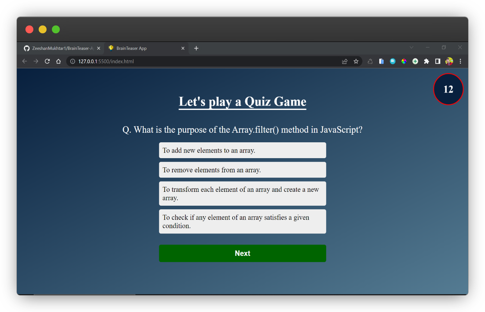
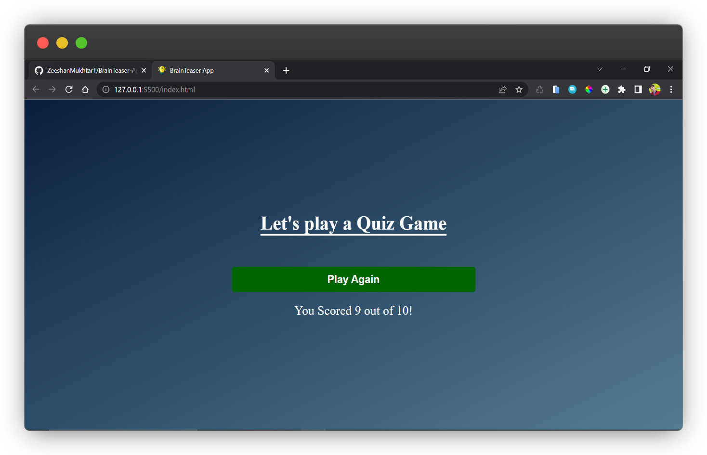

# Brain Teaser App

This is a JavaScript-based Brain Teaser App that asks random web development related questions to the user. The user has to select an answer from the multiple choice answers and can move to the next question using the 'Next' button. The user gets points for each right answer and can play the quiz again if they want.

The app is developed using HTML, CSS, and JavaScript and uses the following components:

- `container`: for creating the display area of the qiiz
- `question`: for displaying the question
- `choices`: for displaying the multiple-choice answers
- `nextBtn`: for moving to the next question
- `scoreCard`: for showing the score
- `alert`: for showing alerts to the user
- `startBtn`: for starting the quiz
- `timer`: for showing the time left for each question

## Features

- Random questions are displayed to the user
- Multiple-choice answers for each question
- Timer for each question
- Display of the final score at the end of the quiz
- Option to play the quiz again

## Instructions to play

1. Click on the 'Start Quiz' button to begin the quiz.
2. Read the question and select your answer from the list of choices.
3. Once an answer is selected, click on the 'Next' button to move to the next question.
4. If the answer is correct, the score will be updated.
5. If the answer is incorrect, the correct answer will be displayed.
6. After all questions are answered, the final score will be shown to the user.
7. Click on the 'Play Again' button to play the quiz again.

## Credits

Thank you for checking out this repository! This app was made by [Zeeshan Mukhtar](https://www.instagram.com/zeshanmukhtar01/) using HTML, CSS, and JavaScript. If you have any feedback or suggestions, feel free to reach out to me. Happy learning!

## Connect With ME

## Screenshot

